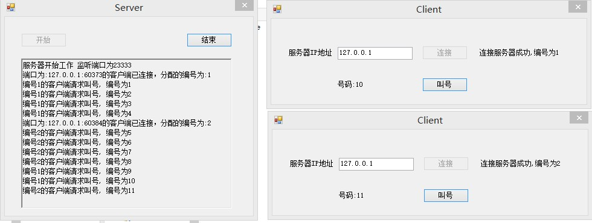
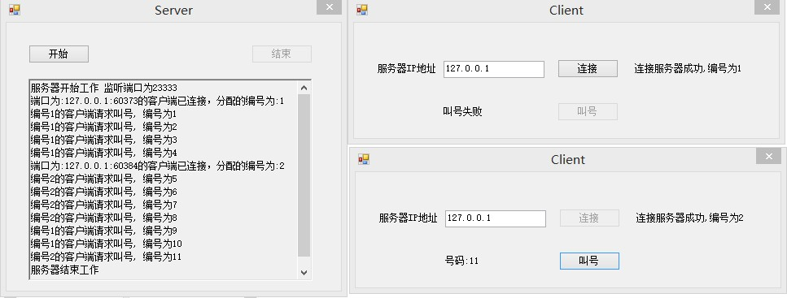
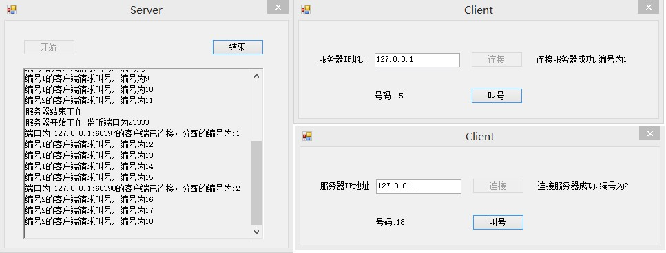

# Readme

## 运行截图

- 两个客户端获取号码

- 服务器暂停工作时获取失败

- 服务器重新开始工作时继续获取

## 运行环境
- 装有.NET Framework 4.0或以上的电脑
- 最好是64位Windows系统
- 本程序在Windows 8.1 + VS2013 + .NET Framework 4.5上运行通过

## 运行向导
1.  直接运行`Server.exe`和`Client.exe`即可
2.  客户端和服务器端程序在`Server`和`Client`文件夹中

## 实现过程
使用了Socket通信。服务器在开启后监听23333端口是否有客户端注册。注册后保持服务器和客户端通信发送请求和回复数据。具体实现参看代码。

## 关于我
- 博客: [Cee‘s Home](https://blog.cee.moe)
- Github: [Cee's Github](https://github.com/cirnocee)